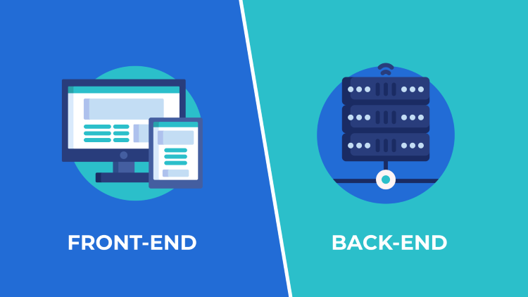
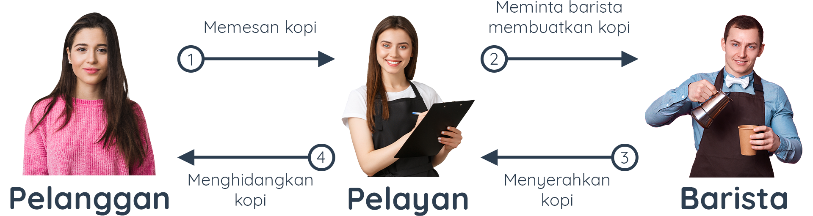
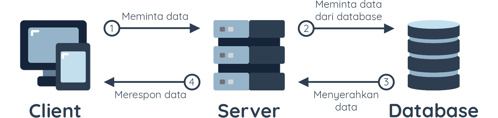

# Pengenalan ke Backend

Dalam pengembangan sebuah software terdapat istilah *Frontend* dan *Backend*, kedua istilah ini biasanya menjadi opsi bidang yang ada di *Software Development*. Istilah *Frontend* digunakan untuk menunjukan bagian aplikasi yang terlihat dan bisa langsung digunakan oleh pengguna, seorang pengembang nya disebut *Frontend Developer*. Sedangkan istilah *Backend* digunakan untuk menunjukan bagian pengelolaan kebutuhan yang tidak ditampilkan, dan untuk pengembangnya disebut *Backend Developer*. Selain kedua istilah tersebut, terdapat pengembang yang mengerjakan kedua sisi tersebut, itu disebut *Full Stack Development*

# Apa itu Backend

Pada modul ini kita akan berfokus untuk mengenal tentang **Backend Development**. Backend merupakan bagian dari aplikasi yang bertanggung jawab untuk menyediakan kebutuhan yang tak terlihat oleh pengguna (tidak berinteraksi langsung dengan pengguna), seperti bagaimana data disimpan, diolah, serta ditransaksikan secara aman. Itu semua bertujuan untuk mendukung aplikasi Frontend bekerja sesuai dengan fungsinya. Sosok yang menggeluti bidang ini disebut Backend Developer.

Sistem aplikasi bekerja mirip seperti sistem bisnis pada dunia nyata. Agar lebih mudah memahami peran Backend dan Frontend, mari analogikan sistem aplikasi layaknya sebuah bisnis kedai kopi.

Jika Frontend kita analogikan sebagai sebuah kedai kopi yang menampilkan kursi, meja, meja kasir, dan segala sesuatu yang bisa dilihat oleh pengunjung; maka Backend adalah bagian dapur yang mengolah kopi pesanan pengunjung yang tidak bisa semua orang dapat masuk ke dalam dapur tersebut. 

# Server

Supaya bagian Frontend dan Backend berjalan saling terhubung, dibutuhkanah sebuah perantara yang menghubungkan antara keduanya. Jika kita kembali ke analogi kedai kopi, pasti seorang pengunjung jika ingin memesan pesanan bagaimana pesanan tersebut bisa sampai ke baristanya? Tentunya ada seorang perantara yang menghubungkannya bukan? Dialah seorang pelayan.

Begitu pula yang terjadi antara interaksi yang terjadi pada sistem aplikasi, Frontend tidak boleh langsung mengakses Backend, begitu pula Backend tidak boleh melakukan transaksi tanpa adanya proses yang dilalui di Frontend. Pada sistem aplikasi, perantara yang dimaksud adalah **"server"** yang posisinya bisa kita analogikan sebagai seorang pelayan di kedai kopi.

Server adalah sebuah sistem yang akan menerima permintaan dari user dan akan mengembalikan response sesuai dengan yang dibutuhkan. Namun perlu diingan! Server bukanlah sebuah perangkat keras ataupun komputer, namun server lebih merujuk kepada sistem yang mampu membuat perangkat (termasuk komputer) dapat menerima dan mengelola permintaan. Jika diterjemahkan kedalam bahasa Indonesia, "server" artinya adalah "pelayan" atau "penyaji".

# Komunikasi antara Client-Server

HTTP/HTTPS adalah sebuah protokol yang biasa digunakan untuk berkomunikasi dengan web server. Protokol tersebut memiliki pola *request-response*, artinya jika kita ingin mendapatkan sesuatu (response) kita harus mengirimkan sebuah permintaan (request).

Jika kita analogikan kembali dengan kedai kopi, sebagai seorang pelanggan perlu membuat permintaan dengan mendatangi kasir (request), setelah itu pelayan/kasir akan menyampaikan permintaan kepada barista dan akan memberikannya kembali kepada anda (response).

Hal yang sama berlaku saat kita mengembangkan aplikasi, khususnya web dalam berkomunikasi dalam server (sebutlah client itu Frontend, dan Server itu Backend) bila menggunakan protocol HTTP/S, Server tidak akan mengirim data apapun jika tidak menerima permintaan dari client. Ketika client meminta sesuatu, maka server akan merespon nya.

Untuk mengirimkan permintaan kepada server haruslah memuat informasi yang jelas, informasi yang dikirimkan oleh client adalah seperti berikut : 

  * **Request line** : berisikan method/verb seperti GET (mengambil data), POST (menambahkan/mengirim data), PUT (memperbaharui data), atau DELETE (menghapus data); path atau alamat yang diminta; dan versi HTTP yang digunakan.
  * **Header** : memuat informasi yang dilampirkan terkait request seperti format dokumen (contoh application/json, text/html, dsb), kunci akses, dsb.
  * **Body (opsional)** : mengandung data yang dibutuhkan oleh server, bisa dalam bentuk teks, JSON, dll. Body tidak wajib dilampirkan bila server tidak membutuhkan data apapun.

Begitupun juga server akan mengirimkan response beserta informasi yang dibutuhkan oleh client. Tidak begitu berbeda seperti informasi yang dikirimkan client, Server juga mengirimkan **Header** dan **Body**, namun bedanya server akan mengembalikan **Status Line** yang menjadi penunjuk apakah response nya menghasilkan nilai yang **sukses** atau **gagal/error** dengan mengembalikan kode status.

<!-- # Daftar Status Line dan Status Code

Biasanya status code berisi 3 digit nilai (2xx, 4xx, 5xx dst). Ada banyak status code yang bisa dikirimkan oleh server, namun untuk sekarang kita hanya perlu mengetahui makna dari angka awal pada setiap status code. Jika berawalan **2**, maka status dari permintaan tersebut **berhasil** diterima oleh server dan mengembalikan nilai yang sukses. Jika berawalan 4 maka permintaan tidak bisa di proses karena terdapat kesalahan client. Dan terakhir jika status code berawalan 5, maka permintaan tidak dapat di proses karena terdapat kesalahan disisi Server.

Berikut daftar kengkapnya :

  * **2xx**
    - **200 – Everything is OK**
      Kode ini muncul saat halaman website atau data bekerja sebagaimana mestinya.
    - **201 – Created**
      Server telah memenuhi permintaan browser Anda. Hasilnya, server membuat data baru.
    - **202 – Accepted**
      Server sudah menerima permintaan browser Anda, tapi masih diproses.
    - **203 – Non-Authoritative Information**
      HTTP code yang satu ini muncul saat penggunaan proxy berhasil dideteksi. Jadi, server proxy menerima kode 200 dari server asli, tapi hasilnya dimodifikasi oleh proxy tersebut sebelum dikirimkan ke browser Anda.
  * **4xx**
    - **400 – Bad Request**
      Server tak bisa memenuhi permintaan karena adanya error dari browser Anda.
    - **401 – Unauthorized**
      Error ini muncul karena browser tak bisa memberikan bukti kewenangan yang sah saat diminta server.
    - **402 – Payment Required**
      Banyak platform yang memunculkan HTTP status code ini saat pengguna tidak memenuhi jumlah pembayaran yang dibutuhkan. Contohnya: melewati batas penggunaan harian Google Developers API, belum membayar biaya Shopify, dan pembayaran melalui Stripe yang gagal diproses.
    - **403 – Access to that resource is forbidden**
      Kode ini muncul saat pengguna berusaha mengakses sesuatu yang tak diizinkan. Misalnya, mengakses konten yang dikunci tanpa login terlebih dahulu.
    - **404 – The requested resource was not found**
      Inilah kode error tiga digit paling terkenal di jagat maya. Error ini menunjukkan bahwa data yang diminta browser itu tidak ada di server.
  * **5xx**
    - **500 – There was an error on the server and the request could not be completed**
      Ini adalah kode generik yang muncul karena adanya kesalahan di server atau “internal server error”.
    - **501 – Not Implemented**
      Error ini muncul karena fungsi server tidak mendukung permintaan dari browser. Error ini hampir selalu karena kesalahan server dan harus diperbaiki oleh penyedia hosting.
    - **502 – Bad Gateway**
      Umumnya, HTTP status code ini muncul karena salah satu server menerima respons yang tak beres dari server lainnya. Misalnya, saat penggunaan proxy server.
    - **503 – The server is unavailable to handle this request right now**
      Kode HTTP status ini terjadi karena server tak bisa memenuhi permintaan Anda saat ini. Mungkin karena server kepenuhan atau yang lainnya. -->

**[<< Sebelumnya](instalasi.md)** | **[Selanjutnya >>](m2-rest.md)**