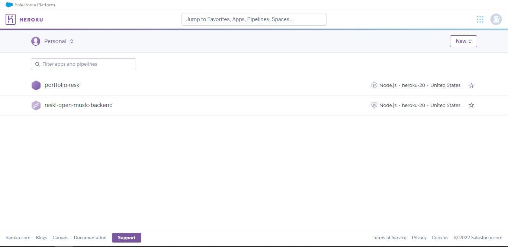
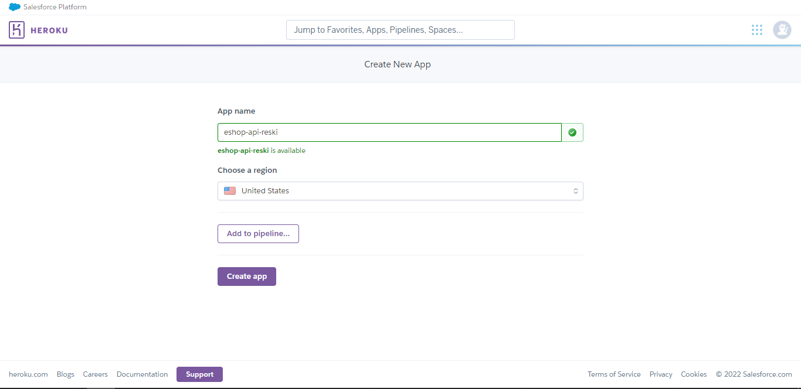
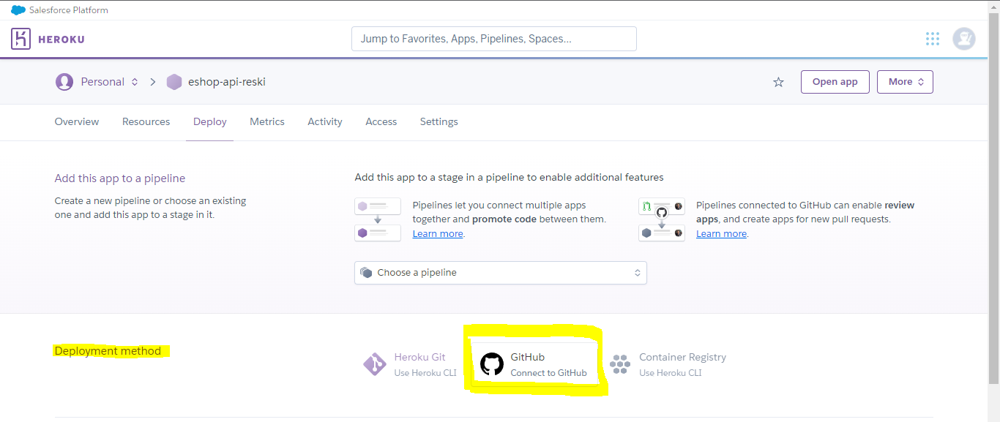
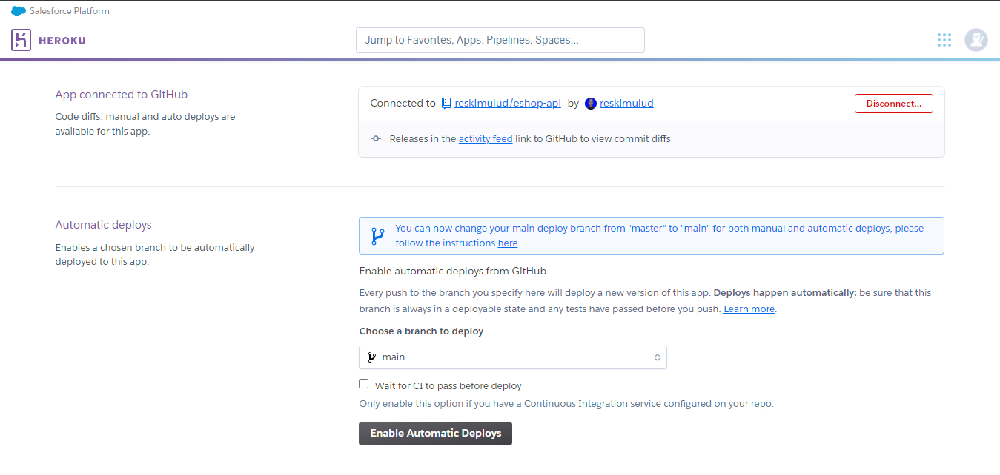
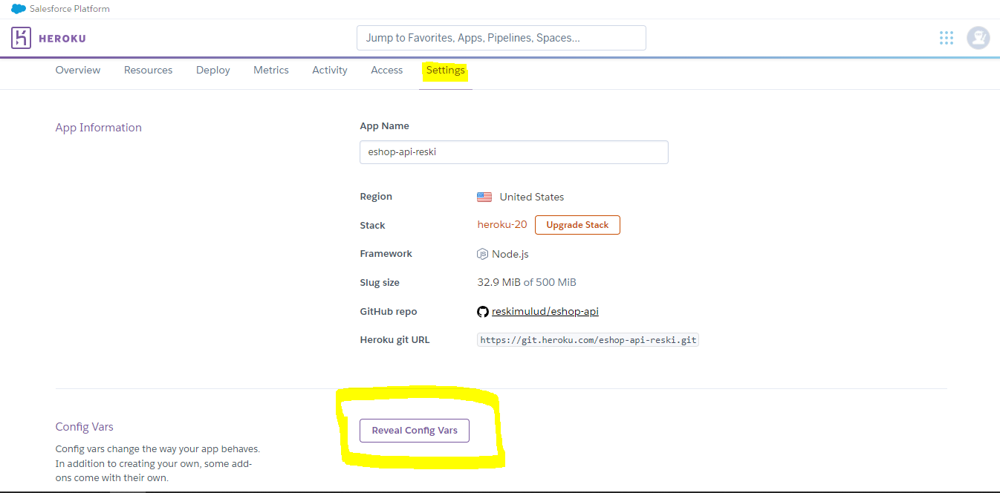
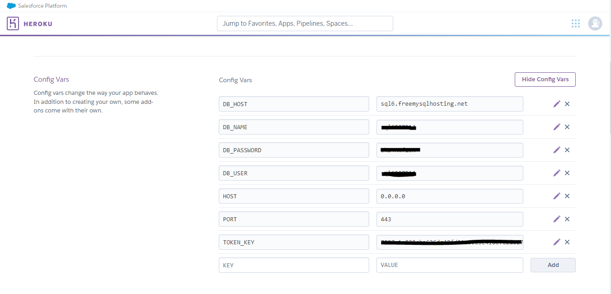

# Mendeploy (Mendistribusikan) API eShop ke Heroku

Kita telah selesai mengembangkan aplikasi API kita, mulai dari membuat fitur authentication (login register), mengambil dan menambahkan produk, keranjang belanja sampai transaksi. Namun semua itu masih berjalan di lokal komputer kita dan orang lain tentu tidak akan bisa mengaksesnya.

Untuk mendeploy API kita membutuhkan sebuah layanan yang mampu menjalankan aplikasi kita, ada banyak yang bisa kita gunakan, baik itu berbayar maupun yang gratis. Namun yang akan kita gunakan yaitu **Heroku**. Sebelumnya sudah kita bahas apa itu heroku di modul [(Sebelum Memulai)](pre-requisite.md).

Kalian harun memiliki akun Heroku terlebih dahulu, untuk itu bagi yang belum membuat akun heroku silahkan buat terlebih dahulu menggunakan email yang terdaftar di **GitHub**. Jika sudah, mari kita ikuti langkah-langkah berikut.

Sebelum memulai untuk mendeploy aplikasi ke heroku, kita harus menambahkan script baru di dalam `package.json` seperti ini

```json
{
  "script": {
    ...
    "start": "node ./scr/server.js"
  }
}
```

# Membuat APP di Heroku

Pertama buka [id.heroku.com](https://id.heroku.com) dan login terlebih dahulu menggunakan akun yang telah kalian buat. Maka selanjutnya akan diarahkan ke dasboard



Selanjutnya klik `New` dan pilih `Create New App`. Maka form untuk membuat app baru akan muncul. Untuk bagian `App name` nya, isi dengan `esho-api-<nama_kalian>` dan biarkan region nya `United States`. Setelah itu tekan `Create App`



Tampilan detail aplikasi akan muncul. Di bagian `Deployment Method`, pilih yang menggunakan **GitHub** dan ikuti perintah yang diminta untuk menghubungkan Heroku dengan GitHub. Selanjutnya pilih repository project `eshop-api` yang kalian buat dan hubungkan (connect).



Jika sudah seperti gambar dibawah artinya heroku sudah terhubung ke repository GitHub kita. Tekan `Enable Automatic Deployment` untuk mengaktifkan proses deploy secara otomatis. Dengan mengaktifkan ini, aplikasi di heroku akan otomatis terupdate jika terdapat commit/push baru.



Saat pertama kali menghubungkan repository ke heroku, kita harus mendeploynya secara manual. Jika sudah maka application akan di build. Jika dibuka maka akan mengalami error, kenapa? Karena applikasi kita memiliki konfigurasi yaitu **database** dan **environment**. Pertama mari kita buat database terlebih dahulu

# Membuat Online Hosting MySQL

Untuk layanan database nya kita akan menggunakan database MySQL yang gratis dari [freemysqlhosting.net](https://www.freemysqlhosting.net). Buka web tersebut dan daftar untuk mulai menggunakan database. Namun perlu diingat, untuk menggunakan layanan ini kita hanya punya waktu **7 hari** menggunakannya secara gratis. Jadi sebetulnya ini hanya untuk tes saja jadi bukan untuk keperluan produksi.

Setelah berhasil mendaftar kalian akan diberikan **credentials** untuk mengakses database tersebut ke email masing-masing. Simpan data tersebut karena kita akan menggunakannya setelah ini.

# Masukan Variable Environment

Sekarang masukan variable environment untuk mengkonfigurasi aplikasi kita di heroku. Pertama buka tab `setting`, scroll kebawah dan klik `Reveal Config Var`.



Setelah itu buat `KEY` dan `VALUE` nya seperti ini



Setelah itu kembali ke tab `Deploy` dan deploy aplikasi secara manual. Jika sudah selesai di build kita coba dengan membukanya di browser. Lalu buka endpoint products. Taraaaaaa, ada error!!

Kenapa? karena table nya belum dibuat. Sekarang kita akan menjalankan `migration` di heroku dengan cara klik `More` dan pilih `Run console`. Di dalam console tersebut jalankan perintah berikut

```bash
npm run miration up
```

Tunggu hasilnya dan buka kembali di browser.

Selamat! Sekarang aplikasi kita sudah bisa dipakai oleh semua orang yang terhubung ke internet.

**[<< Sebelumnya](m14-static-file.md)** | **[Selanjutnya >>](m16-intro-frontend.md)**