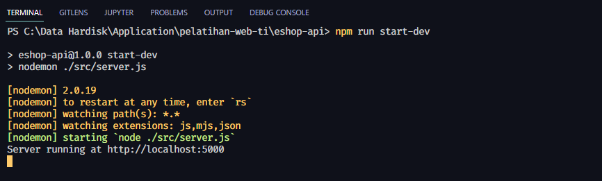

# Membuat REST API dengan Hapi.JS

Sudah saatnya kita mengimplementasikan teori yang kita pelajari sebelumnya, dan sekarang kita akan membuat sistem Backend untuk aplikasi **eShop**. Studi kasus yang akan kita buat yaitu membuat aplikasi *online-shop*. Sebelumnya kita akan mencoba membuat RESTful API sederhana menggunakan framework Hapi.JS. Tidak perlu berlama-lama, mari kita mulai mempraktikannya!

# Membuat Project Node.JS

Untuk menggunakan framework Hapi, kita harus membuat project Node terlebih dahulu, untuk itu kita ikuti langkah berikut.

Buat sebuah folder yang akan menyiimpan projek kita secara keseluruhan (Backend dan Frontend), kalian bisa simpan dimana saja asalkan mudah diingan. Beri nama folder tersebut `eshop`, didalam folder eshop buat lagi folder `eshop-api`. Di dalam folder esho-api klik kanan dan pilih `Git Bash Here` (pastikan telah menginstall Git). Setelah itu jalankan perintah berikut

```bash
npm init
```

> Untuk mempercepat proses inisialisasi bisa gunakan perintah **npm init --y** jika ingin melewati pertanyaan yang ditanyakan oleh npm

Setelah itu akan otomatis dibuatkan file `package.json`. Lalu jalankan perintah berikut untuk membuka folder di VS Code

```bash
code .
```

Karena nantinya kita akan menyimpan projeck ke GitHub, maka inisialisasikan project tersebut menjadi repository (instruksi akan dijelaskan di kelas). Jangan lupa untuk membuat file bernama `.gitignore` yang bertujuan untuk **mengabaikan** file atau folder supaya tidak ditambahkan ke repository. Isi file tersebut seperti dibawah ini

```.gitignore
/node_modules
.env
```

Ini bertujuan untuk mengabaikan folder `node_modules` dan file `.env`

Selanjutnya jalankan perintah untuk menginstall Hapi di terminal, ikuti seperti dibawah ini. Selain Hapi, kita juga akan menginstall library lain sekaligus.

  * Hapi `@hapi/hapi`
  * Nodemon `nodemon` : berfungsi untuk mereset server node jika terjadi perubahan di projek
  * Dot ENV `dotenv` : berfungsi untuk memanggil variable environment yang ada di file .env

```bash
npm install @hapi/hapi dotenv
npm install --save-dev nodemon
```
> untuk nodemon menggunakan flag `--save-dev` karena kita hanya ingin menginstall nodemon untuk digunakan di proses development dan tidak diinstall jika sudah ada di mode produksi

Maka kita telah siap untuk membuat API sederhana, cus kita lanjutkan!

# Membuat REST API sederhana dengan Hapi

Pertama-tama, buatlah struktur folder seperti ini
```
eshop-api
  ├─src
  | └─server.js
  ├─package.json
  └─.gitignore
```

Di dalam `server.js` import library **dotenv** dan **hapi**

```js
require('dotenv').config();
const hapi = require('@hapi/hapi');
```

Selanjutnya kita akan membuat server Hapi dengan membuat method `init` dan menginisialisasikan `server` didalam method init.

```js
const init = async () => {

  const server = Hapi.server({
    host: process.env.HOST,
    port: process.env.PORT,
    routes: {
      cors: {
        origin: ['*'],
      },
    },
  });

};
```

Perhatikan kode berikut `process.env.HOST`, artinya kita mengambil variable yang ada di file `.env`, kita buat file .env didalam root directory (didalam `eshop`). Dan isi file .env dengan berikut :

```.env
HOST=localhost
PORT=5000
```

Kembali ke file `server.js`, sekarang kita akan membuat perutean (routing) dengan menuliskan kode berikut.

```js
const init = async () => {
  ...

  server.route({
    method: 'GET',
    path: '/',
    handler: () => ({
      name: 'Rski Mulud Muchamad',
    }),
  });
};
```

Terakhir kita jalankan servernya dengan menuliskan kode di bawah ini

```js
const init = async () => {

  ...

  await server.start();
  console.log(`Server running at ${server.info.uri}`);

};
```

Maka secara keseluruhan file `server.js` akan seperti ini

```js
require('dotenv').config();

const Hapi = require('@hapi/hapi');

const init = async () => {

  const server = Hapi.server({
    host: process.env.HOST,
    port: process.env.PORT,
    routes: {
      cors: {
        origin: ['*'],
      },
    },
  });

  server.route({
    method: 'GET',
    path: '/',
    handler: () => ({
      name: 'Rski Mulud Muchamad',
    }),
  });

  await server.start();
  console.log(`Server running at ${server.info.uri}`);

};

init()

```

Selanjutnya kita ke file `package.json`, dibagian "script" tambahkan kode berikut

```json
{
  ...
  "script": {
    "start": "node ./src/server.js",
    "start-dev": "nodemon ./src/server.js"
  }
}
```

Script tersebut berfungsi jika kita ingin menjalankan server, kita tinggal menjalankan perintah `npm run start-dev` di terminal (untuk proses development). Sedangaka script `start` berfungsi untuk proses produksi/deployment (kita bahas di materi deployment).

Waktunya kita mencoba API yang kita buat dengan menjalankan perintah berikut dan kita bisa mencobanya di Postman.

```bash
npm run start-dev
```



Selamat! Kita telah membuat API menggunakan framework Hapi.JS. Selanjutnya kita akan mengimplementasikannya langsung sesuai studi kasus **eShop**

**[<< Sebelumnya](m2-rest.md)** | **[Selanjutnya >>](m4-detail-project.md)**
