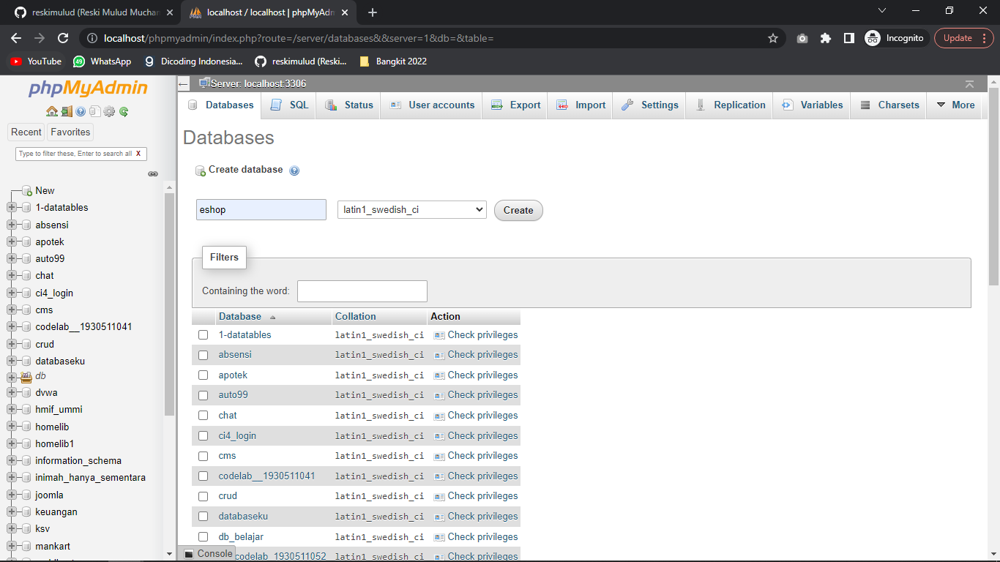
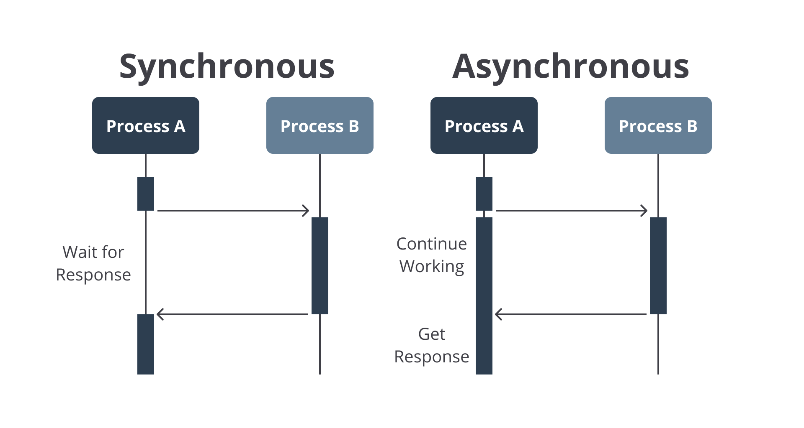

# Membuat Database dan Koneksi

# Membuat Database

Untuk membuat database, langkah pertama yaitu silahkan untuk membuka **phpMyAdmin** di browser kalian (pastikan telah menginstall XAMPP dan bagian **MySQL** sudah berwarna hijau). Di bagian database, masukan nama database baru yaitu `eshop` dan klik **Create**.



Setelah itu kita tambahkan beberapa variable di file `.env` seperti ini. Variable tersebut akan kita gunakan sebagai **credential** untuk koneksi ke database.

```.env
DB_HOST=localhost
DB_USER=root
DB_PASSWORD=
DB_NAME=eshop
```

> Secara default di XAMPP, username adalah **root** dan passwordnya kosong, jika kalian menggunakan konfigurasi berbeda, maka sesuaikanlah.

Selanjutnya kita akan membuat konfigurasi untuk mengoneksikan database dengan aplikasi yang kita buat.

# Koneksi Database

Pertama-tama, yang kita lakukan yaitu menginstall library atau dependency `mysql` untuk menghubungkan aplikasi Node kita dengan database mysql. Langsung saja kita install dependency tersebut dengan menjalankan perintah berikut

```bash
npm install mysql
```

Setelah selesai terinstall, selanjutnya kita akan membuat folder `conf` di dalam folder `src`. Setelah itu buat file JavaScript dengan nama `Database.js`. File ini berfungsi jika kita ingin mengoneksikan database dan akan kita buat method `query` untuk menjalankan query mysql nantinya.

Kita masukan konfigurasi **dotenv** dan import **mysql** kedalam file tersebut

```js
require('dotenv').config();
const mysql = require('mysql');
```

Setelah itu kita buat **class Database** dan di dalam **constructor** nya kita akan membuat koneksi ke database sesuai dengan credential yang sudah kita definisikan sebelumnya.

```js
class Database {

  constructor() {
    this.connection = mysql.createPool({
      connectionLimit: 10,
      host: process.env.DB_HOST,
      user: process.env.DB_USER,
      password: process.env.DB_PASSWORD,
      database: process.env.DB_NAME,
    });
  }
}
```

Masih di dalam class Database, sekarang kita buat method `query`

```js
class Database {
  ...

  query(query) {
    return new Promise((resolve, reject) => {
      this.connection.query(query, (err, result) => {
        if (err) {
          reject(err);
        }

        resolve(result);
      });
    });
  }
}
```

Perhatikan kode di atas, method tersebut mengembalikan nilai `Promise`. **Promise** adalah sebuah metode yang digunakan untuk menjalankan kode secara **asyncronous** di JavaScript. Untuk menghubungkan aplikasi dengan database dan menjalankan query, dibutuhkan metode asyncronous, dan yang kita gunakan adalah promise. Apa itu Asyncronous? Simak penjelasan berikut

# Syncronous vs Asyncronous

Dalam dunia programming kedua istilah ini digunakan untuk membedakan tentang cara urutan eksekusi perintah-perintah yang ada dalam kode anda.



**Synchronous** adalah yang paling umum dan mudah di mengerti. Setiap perintah di eksekusi satu persatu sesuai urutan kode yang anda tuliskan, karena setiap perintah harus menunggu perintah sebelumnya selesai. Proses seperti ini disebut **‘blocking’**.

Sedangkan **Asynchronous** hasil eksekusi atau output tidak selalu berdasarkan urutan kode, tetapi berdasarkan waktu proses. Eksekusi dengan asynchronous tidak akan membloking atau menunggu suatu perintah sampai selesai. Daripada menunggu, asynchronous akan mengeksekusi perintah selanjutnya.

Untuk membantu lebih mamahaminya, silahkan baca artikel berikut saat waktu luang.

  * [Panduan Komplit Asynchronous Programming pada Javascript](https://medium.com/coderupa/panduan-komplit-asynchronous-programming-pada-javascript-part-1-fca22279c056)
  * [Memahami Synchronous dan Asynchronous Javascript](https://dev.to/guntur/memahami-synchronous-dan-asynchronous-javascript-4kjj)

Untuk saat ini mari kita lanjutkan ke aplikasi kita!

# Simpan perubahan ke Git dan GitHub

Saat ini kita telah selesai melakukan konfigurasi database dan siap digunakan. Selanjutnya kita akan merekam atau menyimpan progres kita kedalam repository Git (commit). Jalankan perintah berikut untuk membuat `commit`

```bash
git add .
git commit -m "membuat konfigurasi untuk koneksi ke database"
gith push
```

**[<< Sebelumnya](m4-detail-project.md)** | **[Selanjutnya >>](m6-auth.md)**