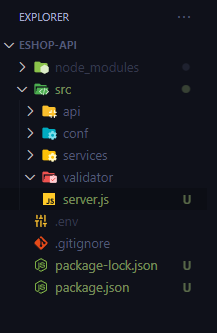

# Authentikasi (Login dan Register)

Tibalah saaynya kita membuat fitur demi fitur untuk melengkapi fungsionalitas API yang akan kita buat. Untuk membuat setiap fitur, nantinya kita akan melakukan langkah-langkah atau metode yang berulang. Maka dari itu **simak penjelasan berikut**.

  1. **Migration**

Seperti yang sudah dijelaskan sebelumnya, kita akan menggunakan migrasi untuk membuat table. Tahap ini sangat penting, jadi jangan sampai terlewat yah.

  2. **Services**

*Services* adalah sebuah kumpulan kode program yang menuliskan logika atau alur program yang menangani pengambilan data dari database. Segala yang berhubungan dengan data dan **error handling** jika data yang diminta tidak terdapat dalam database akan dituliskan disini.

  3. **Validator**

Kita tentu menginginkan apa yang dikirimkan oleh user (payload/body) sesuai dengan yang kita harapkan. Itulah fungsi *validator*. Di dalam validator terdapat schema yang **memvalidasi** data apa yang boleh dikirimkan oleh client/user dan tentunya akan mengembalikan response gagal/error jika user mengirimkan data yang tidak sesuai. Untuk validasi kita akan menggunakan bantuan dari library **Joi**.

  4. **Plugin**

Plugin dapat diartikan sebagai **sesuatu yang dapat di lepas dan pasang**, begitu juga yang akan kita buat. Dalam framework Hapi kita bisa membuat sebuah plugin, alih-alih menuliskan semua kode di dalam file `server.js`, lebih baik kita memisahkan masing-masing fitur di tempat yang berbeda. Dengan begitu kode yang kita buat akan lebih tertata dan mudah untuk dipelihara.

Di dalam plugin terdapat routes (yang mengelola method, path, serta handler yang akan dipanggil untuk setiap method) dan juga handler (yang akan mengatur request dan mengembalikan response ke user). Setelah itu kita akan **mendaftarkan/register** plugin tersebut untuk digunakan didalam file `server.js`.

---

Selain penjelasan di atas, kita juga akan menggunakan sebuah metode (atau disebut juga *Design Pattern*) **Dependency Injection**. Secara sederhananya, Dependency Injection (DI) adalah suatu metode yang mengatur bagaimana sebuah object digunakan. Contoh : jika kita membuat object `Engine` di dalam class `Car`, artinya **class Car depend/bergantung ke class Engine**

```js
class Engine {
  start() {
    return 'Mulai';
  }
}

class Car {
  constructor() {
    this.engine = new Engine();
  }

  start() {
    return this.engine.start();
  }
}

const car = new Car();
car.start();
```

Ketergantungan seperti ini harusnya dihindari, karena class Car akan sangat bergantung pada class Engine. Selain itu jika setiap class Car dipanggil, akan selalu membuat **instance** Engine baru, dan itu akan mengalokasikan memory baru lagi. Memang tidak terasa, tapi jika aplikasi kita sudah banyak yang menggunakan bahkan satu detik bisa ratusan response ini akan memenuhi resource dan membuat performa menjadi lebih lambat.

Maka solusinya mengimplementasikan dependency injection. Maka kode berikut akan menjadi seperti ini :

```js
class Engine {
  start() {
    return 'Mulai';
  }
}

class Car {
  constructor(engine) {
    this.engine = engine;
  }

  start() {
    return this.engine.start();
  }
}

const engine = new Engine();
const car = new Car(engine);
car.start();
```

Dengan begitu instance Engine hanya dibuat sekali dan akan dikirimkan ke object Car melalui constructor.

  * [Dasar Dependency Injection (DI)](https://medium.com/@rakateja/dasar-dependency-injection-442ef9c3b204)

# Migration create-table-users

Tahapan pertama adalah membuat table users di database dengan menggunakan migration. Jalankanlah perintah tersebut

```bash
npm run migration add migration create-table-users
```

Maka file `<timestamp>_create-table-users.js` akan dibuat. Buka file tersebut dan masukan kode berikut

```js
module.exports = {
    "up": `CREATE TABLE users (
            id VARCHAR(50) NOT NULL,
            email TEXT NOT NULL,
            name TEXT NOT NULL,
            password TEXT NOT NULL,
            role TEXT NOT NULL,
            PRIMARY KEY (id))`,
    "down": "DROP TABLE users"
}
```

Jalankan perintah berikut

```bash
npm run migration up
```

Maka table users sudah siap digunakan.

# AuthenticationService

Sebelumnya kita atur terlebih dahulu struktur projek dari aplikasi kita seperti ini

;

> conf adalah folder configurasi database yang sudah dibuat sebelumnya

Setelah itu install dependency berikut

```bash
npm install bcrypt nanoid
```

> bcrypt digunakan untuk **mengenkripsi password**, dan nanoid untuk membuat random string yang akan kita gunakan untuk membuat **id**

Di dalam folder `services` buatlah folder `mysql` dan didalamnya buat file dengan nama `AuthenticationService.js`, dan buat *constructor* nya

```js
class AuthenticationService {
  #database;

  constructor(database) {
    this.#database = database;
  }
}

module.exports = AuthenticationService;
```

Selanjutnya buat method untuk mendaftar akun baru (register), fungsi yang dibuat adalah **asyncronous**

```js
const {nanoid} = require('nanoid');
class AuthenticationService {
  ...

  async register(email, name, password) {
    const id = `user-${nanoid(16)}`;
    const hashedPasword = await bcrypt.hash(password, 10);

    const query = `INSERT INTO users (id, email, name, password, role) VALUES (
      '${id}', '${email}', '${name}', '${hashedPasword}', 'user'
    )`;

    const result = await this.#database.query(query);
    console.log(result);

    if (!result || result.length < 1 || result.affectedRows < 1) {
      throw new Error('Gagal menambahkan user');
    }

    return id;
  }
}
```

> Supaya tidak menjadi error di nanoid, turunkan versinya ke `^3.2.0` di package.json

Untuk memverifikasi apakah belum ada yang mendaftar menggunakan email yang sama, buatlah sebuah method untuk memferifikasi email dengan nama `verifyUserEmail` (jadikan private). Dan panggil di method register di paling awal.

```js
class AuthenticationService {
  ...

  async #verifyUserEmail(email) {
    const query = `SELECT email FROM users WHERE email = '${email}'`;

    const result = await this.#database.query(query);

    if (result.length > 0 || result.affectedRows > 0) {
      throw new Error('Gagal menambahkan user, email telah digunakan');
    }
  }

  async register(email, name, password) {
    await this.#verifyUserEmail(email);
    ...
  }
}
```

Setelah itu kita buat method untuk mengambil data user (email dan nama)

```js
class AuthenticationService {
  ...

  async getUserById(userId) {
    const query = `SELECT name, email FROM users WHERE id = '${userId}'`;

    const result = await this.#database.query(query);

    if (!result || result.length < 1 || result.affectedRows < 1) {
      throw new Error('User tidak ditemukan');
    }

    return result[0];
  }

  ...
}
```

Terakhir method untuk login

```js
class AuthenticationService {
  ...

  async login(email, password) {
    const query = `SELECT id, email, password, role FROM users WHERE email = '${email}'`;

    const result = await this.#database.query(query);

    if (!result || result.length < 1 || result.affectedRows < 1) {
      throw new Error('Email atau password salah');
    }

    const { id, password: hashedPassword, role } = result[0];

    const isValid = await bcrypt.compare(password, hashedPassword);

    if (!isValid) {
      throw new Error('Email atau password salah');
    }

    return { id, role };
  }
}
```

# AuthenticationValidator

Buat folder `authentication`  di dalam folder `validator` dan buat file `schema.js` beserta `index.js`. Namun sebelum kita membuat schema, install terlebih dahulu library **Joi** dengan menjalankan perintah berikut

```bash
npm install joi
```

Setelah selesai kita buka file `schema.js`, dan buat skema seperti ini

```js
const Joi = require('joi');

const RegisterPayloadSchema = Joi.object({
  email: Joi.string().email().required(),
  name: Joi.string().required(),
  password: Joi.string().required(),
});

const LoginPayloadSchema = Joi.object({
  email: Joi.string().email().required(),
  password: Joi.string().required(),
});

module.exports = { RegisterPayloadSchema, LoginPayloadSchema };
```

Setelah itu untuk membuat method untuk memvalidasi payload/body dari yang dikirimkan user akan kita buat di file `index.js`

```js
const { RegisterPayloadSchema, LoginPayloadSchema } = require('./schema');

const AuthenticationValidator = {
  validateRegisterPayload: (payload) => {
    const validationResult = RegisterPayloadSchema.validate(payload);
    if (validationResult.error) {
      throw new Error(validationResult.error.message);
    }
  },
  validateLoginPayload: (payload) => {
    const validationResult = LoginPayloadSchema.validate(payload);
    if (validationResult.error) {
      throw new Error(validationResult.error.message);
    }
  },
};

module.exports = AuthenticationValidator;
```

# Plugin Authentication (routes, handler)

Setelah **service** dan **validator** sudah dibuat, saatnya kita gunakan di dalam plugin. Pertama buatlah folder `authentication` di dalam folder `api`. Dan buat tiga file berikut : `routes.js`, `handler.js` dan `index.js`. Di dalam file `routes.js` buatlah seperti ini

```js
const routes = (handler) => [
  {
    method: 'POST',
    path: '/register',
    handler: handler.postRegister,
  },
  {
    method: 'POST',
    path: '/login',
    handler: handler.postLogin,
  },
  {
    method: 'GET',
    path: '/user/{id}',
    handler: handler.getUser,
  },
];

module.exports = routes;
```

Setelah itu kita akan membuat handler untuk authentication dan mengimplementasikan service beserta validator nya disini dengan menginjectnya. Definisikan class **AuthenticationHandler** di file `handler.js` dan buatlah tiap-tiap method nya (samakan seperti yang ada di routes)

```js
class AuthenticationHandler {
  #service;
  #validator;

  constructor(service, validator) {
    this.#service = service;
    this.#validator = validator;

    this.postRegister = this.postRegister.bind(this);
    this.postLogin = this.postLogin.bind(this);
    this.getUser = this.getUser.bind(this);
  }

  async postRegister(request, h) {}

  async postLogin(request, h) {}

  async getUser(request, h) {}
}

module.exports = AuthenticationHandler;
```

Pertama kita akan membuat handler untuk register

```js
class AuthenticationHandler {
  ...

  async postRegister(request, h) {
    this.#validator.validateRegisterPayload(request.payload);
    const { email, name, password } = request.payload;

    const id = await this.#service.register(email, name, password);

    const response = h.response({
      status: 'success',
      message: 'User berhasil ditambahkan',
      data: {
        id,
      },
    });
    response.code(201);
    return response;
  }

  ...
}
```

Selanjutnya kita akan membuat handler untuk login


```js
class AuthenticationHandler {
  ...

  async postLogin(request, h) {
    this.#validator.validateLoginPayload(request.payload);
    const { email, password } = request.payload;

    const { id } = await this.#service.login(email, password)

    return {
      status: 'success',
      message: 'User berhasil login',
      data: {
        id,
      },
    };
  }

  ...
}
```

Terakhir kita akan membuat handler untuk mengambil data user

```js
class AuthenticationHandler {
  ...

  async getUser(request, h) {
    const { id: userId } = request.params;
    const user = await this.#service.getUserById(userId);

    return {
      status: 'success',
      message: 'Data user berhasil diambil',
      data: {
        user,
      },
    };
  }

  ...
}
```

Maka semua handler telah selesai kita buat

Tahap terakhir dalam membuat plugin di hapi yaitu mendaftarkannya (register) dan pasang di file `server.js`. Buat `index.js` seperti ini.

```js
const AuthenticationHandler = require('./handler');
const routes = require('./routes');

module.exports = {
  name: 'authentication',
  version: '1.0.0',
  register: async (server, { service, validator }) => {
    const handler = new AuthenticationHandler(service, validator);
    server.route(routes(handler));
  },
};

```

Di dalam file `index.js` kita meng **inject** service dan handler ke dalam class AuthenticationHandler. Dan yang terakhir adalah pasang plugin yang telah kita buat ke server. Buka file `server.js` dan tambahkan kode berikut didalamnya (tanpa menghapus kode sebelumnya)

```js
...

const Database = require('./conf/Database');

// authentication
const authentication = require('./api/authentication');
const AuthenticationService = require('./services/mysql/AuthenticationsService');
const AuthenticationValidator = require('./validator/authentication');

const init = async () => {
  const database = new Database();
  const authenticationService = new AuthenticationService(database);

  const server = Hapi.server({
    ....
  });

  // register internal plugins
  await server.register([
    {
      plugin: authentication,
      options: {
        service: authenticationService,
        validator: AuthenticationValidator,
      },
    },
  ]);

  ...
}

```

Jangan lupa untuk menjalankan server nya dan tes API di Postman (akan dipandu di kelas)

Simpan perubahan di Git dan push ke GitHub

```bash
git add .
git commit -m "Membuat fitur untuk authentikasi"
git push
```

Selamat! Kita telah berhasil membuat satu fitur untuk sistem authentikasi (login register). Yuk kita lanjut ke materi berikutnya.

**[<< Sebelumnya](m5-database.md)** | **[Selanjutnya >>](m7-error-handling.md)**
